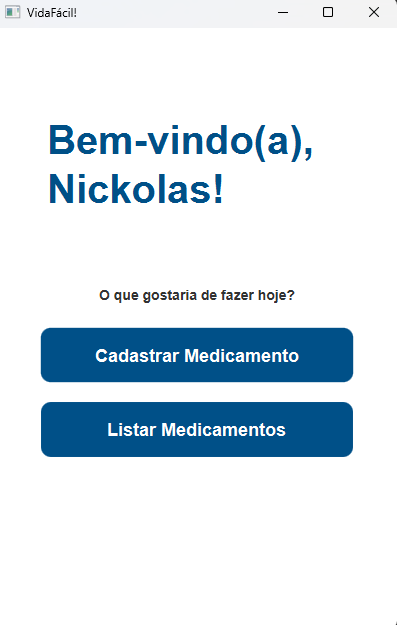
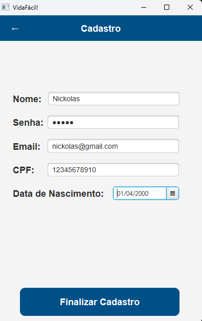
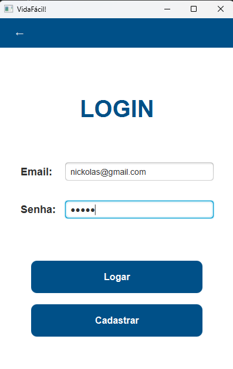
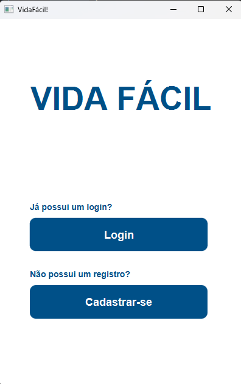
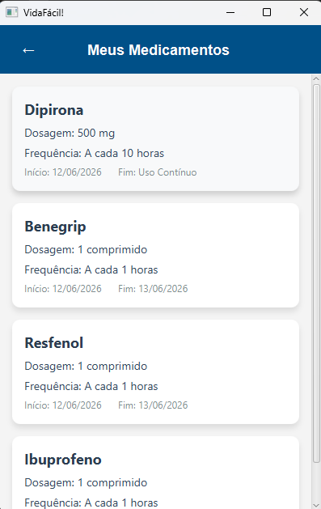
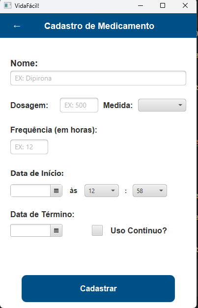

# Vida Fácil 💊

O **Vida Fácil** é um aplicativo de gerenciamento de medicamentos focado em promover a autonomia, segurança e qualidade de vida da pessoa idosa.

Este projeto nasceu inicialmente como uma proposta de curricularização integrando três disciplinas acadêmicas (Sistemas de Informação, Linguagem de Programação e Engenharia de Software 1). No semestre seguinte, o projeto foi totalmente refeito para a matéria de Engenharia de Software 2 como forma de consolidar uma base arquitetural sólida, moderna e focada na excelência da experiência do usuário.

---

## 🚀 Funcionalidades Principais

O gerenciamento manual de medicamentos, frequentemente feito em papel ou dependendo apenas da memória, apresenta falhas que podem resultar em esquecimentos ou dosagens incorretas. O Vida Fácil atua diretamente nesse problema oferecendo:

* **Gestão de Medicamentos:** Cadastro detalhado de remédios, permitindo registrar o nome, a dosagem exata e a frequência de uso.
* **Monitoramento e Listagem:** Uma interface clara onde o usuário pode visualizar rapidamente todos os medicamentos em uso e suas respectivas rotinas.
* **Acessibilidade Mobile-First:** Embora seja uma aplicação Desktop, toda a interface gráfica foi projetada em um formato vertical e simplificado, simulando a experiência de um aplicativo mobile. O objetivo é facilitar a navegação por pessoas com pouca familiaridade tecnológica e posteriormente criar uma aplicação verdadeiramente mobile.

---

## 🛠️ Tecnologias e Arquitetura

O projeto foi construído seguindo o padrão de arquitetura **MVC** (Model-View-Controller) para garantir um código limpo e responsabilidades bem definidas.

* **Java** (Linguagem Principal)
* **JavaFX & SceneBuilder** (Construção da Interface Gráfica)
* **Maven** (Gerenciamento de Dependências e Build)

**Segurança e Persistência Adicionais:**
Para suportar o funcionamento da aplicação de forma ágil e segura, o sistema utiliza o banco de dados local **SQLite** para armazenar os registros no próprio dispositivo do usuário. Além disso, conta com uma camada de segurança utilizando a biblioteca **jBCrypt**, que realiza o *hash* das senhas no momento do login e cadastro, garantindo a proteção dos dados sensíveis.

---

## 📸 Capturas de Tela

Abaixo estão algumas telas do funcionamento do sistema:

| Tela Inicial |               Cadastro de Usuário                |               Tela de Login                |
| :---: |:------------------------------------------------:|:------------------------------------------:|
|  |  |  |

| Menu Principal | Meus Medicamentos | Cadastrar Medicamento |
| :---: | :---: | :---: |
|  |  |  |

---

## 🔮 Passos Futuros (Roadmap)

O aplicativo continuará em evolução para agregar ainda mais valor ao bem-estar do usuário. As próximas implementações previstas são:

* **Integração com Cuidadores:** Permitir o vínculo da conta do idoso com a de um familiar ou cuidador, facilitando o acompanhamento da rotina de medicamentos por terceiros.
* **Controle de Hidratação e Metas:** Implementação de um módulo dedicado para o monitoramento da ingestão de água diária, auxiliando na saúde geral do usuário.
* **Sincronização em Nuvem:** Estabelecer uma conexão com um banco de dados na nuvem, permitindo o backup seguro das informações e a sincronização dos dados entre múltiplos dispositivos.

---

## 👨‍💻 Desenvolvedores

Projeto desenvolvido em conjunto pela equipe:

* Caio Henrique Felix dos Reis Lopes
* Fernando Freire Oliveira
* Maria Eduarda Ferreira Santos
* Miguel dos Santos Conforte
* Nickolas Aranha Martinez
* Nicolas Yuji Hiratani